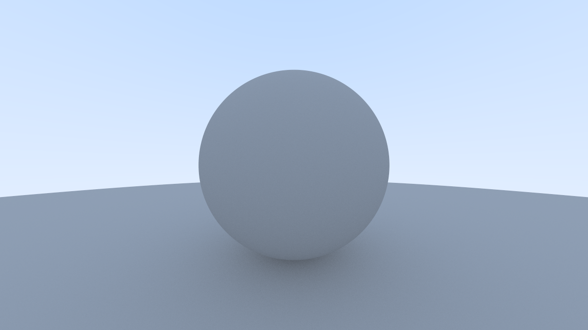

# CPU-to-CUDA Path Tracer

A Monte Carlo path tracer implemented first as a single-threaded C++ CPU
renderer and then ported to CUDA for GPU execution.

The project focuses on the engineering differences between CPU- and
GPU-oriented code, including flattened scene representation, iterative ray
processing, per-thread random-number generation, SIMT divergence, benchmarking,
and profiler-guided optimization.



## Features

- Diffuse global illumination
- Antialiasing through multi-sample rendering
- Iterative ray bounces with a fixed maximum depth
- Gamma-corrected output
- Sphere-based scene representation
- Single-threaded C++ reference implementation
- CUDA renderer using one GPU thread per pixel
- Per-thread cuRAND state
- Reproducible performance benchmarks
- NVIDIA Nsight Compute profiling

## CPU-to-GPU Port

The CPU implementation was reworked for GPU execution by:

- flattening scene data into a contiguous sphere array;
- replacing recursive ray processing with an iterative bounce loop;
- using single-precision arithmetic in the CUDA implementation;
- assigning one CUDA thread to each output pixel;
- maintaining independent per-thread cuRAND state; and
- reducing control-flow patterns that are expensive under SIMT execution.

## Optimization History

### Initial CUDA Port

The initial CUDA implementation reduced rendering from a 22.9 s
single-threaded CPU baseline to approximately 18.5 ms of GPU kernel time on an
NVIDIA RTX 4090.

### Analytic Sphere Sampling

The first GPU optimization replaced rejection-based random sphere sampling
with analytic uniform-sphere sampling.

Rejection sampling can require a different number of iterations for threads
within the same warp. Replacing it with a fixed-cost analytic method removed
that rejection loop and reduced kernel time from approximately 18.5 ms to a
10-run average of 15.04 ms, an improvement of approximately 18.7%.

### Nsight Compute Profiling

The optimized kernel was then analyzed with NVIDIA Nsight Compute.

Profiling showed that the renderer was compute-heavy rather than
DRAM-bandwidth-bound. The precise optimized build used 66 registers per thread,
reached 50.29% achieved occupancy, and executed approximately 14.05 billion
dynamic instructions during the measured workload.

Nsight's instruction analysis also identified substantial floating-point
optimization opportunity.

### Fast-Math Optimization

Based on the profiling results, a separate build using CUDA's
`--use_fast_math` option was tested.

Across ten runs, average kernel time fell from:

```text
15.04 ms
```

to:

```text
10.73 ms
```

a further reduction of approximately **28.7%**.

Nsight Compute measured several corresponding changes:

| Metric | Precise | Fast Math |
| --- | ---: | ---: |
| Nsight kernel duration | 15.88 ms | 10.98 ms |
| Registers per thread | 66 | 59 |
| Theoretical occupancy | 58.33% | 66.67% |
| Achieved occupancy | 50.29% | 56.08% |
| Avg. active threads per warp | 14.38 | 16.01 |
| Executed instructions | 14.05 B | 9.26 B |
| L1/TEX hit rate | 99.93% | 99.93% |

The dynamic executed-instruction count fell by roughly 34%, while lower
register demand allowed additional resident warps.

From the initial CUDA implementation to the final fast-math version, kernel
time fell by approximately **42%**.

## Benchmark Results

Benchmark configuration:

- Resolution: 1200 x 675
- Samples per pixel: 500
- Maximum ray bounces: 10
- CPU: Intel Core i7-13700K
- GPU: NVIDIA RTX 4090
- CUDA toolkit: 12.9
- GPU target: `sm_89`

| Implementation | Measured time | Approx. speedup vs CPU |
| --- | ---: | ---: |
| Single-threaded CPU (`-O2`) | 22.9 s | 1x |
| Initial CUDA port | ~18.5 ms | ~1,238x |
| CUDA + analytic sphere sampling | 15.04 ms | ~1,523x |
| CUDA + fast math | 10.73 ms | ~2,134x |

The CPU number measures the single-threaded CPU renderer while the GPU numbers
measure CUDA kernel execution, so these speedups should be interpreted as
project-level comparisons rather than perfectly identical end-to-end timing
scopes.

Detailed methodology and machine-readable results are available in
[`benchmarks/`](benchmarks/).

## Output Quality

CUDA fast math intentionally relaxes some floating-point behavior, so the
precise and fast-math images are not bit-identical.

The renderer uses deterministic per-pixel cuRAND initialization, allowing the
two builds to be compared directly.

ImageMagick measured:

```text
RMSE: 28.0014
Normalized RMSE: 0.000427275
```

The renders were also inspected visually side-by-side.

This small output difference was accepted in exchange for the measured
performance improvement in the optimized build.

## Build

Requirements:

- CUDA toolkit
- `nvcc`
- C++ compiler
- NVIDIA GPU compatible with the configured architecture

Build the CPU reference and final optimized GPU implementation:

```sh
make
```

This produces:

```text
rt
rtgpu
```

The default `rtgpu` build uses `--use_fast_math`.

Build the precise-math GPU comparison:

```sh
make precise
```

which produces:

```text
rtgpu-precise
```

Build an optimized binary containing source-line information for profiling:

```sh
make profile
```

which produces:

```text
rtgpu-profile
```

## Run

CPU:

```sh
./rt
```

Final optimized CUDA implementation:

```sh
./rtgpu
```

Precise CUDA comparison:

```sh
./rtgpu-precise
```

## Profiling

The profiling target adds CUDA source-line information:

```sh
make profile
```

An example Nsight Compute profiling command is:

```sh
sudo /opt/nvidia/nsight-compute/2025.2/ncu \
    --section SpeedOfLight \
    --section LaunchStats \
    --section Occupancy \
    --section ComputeWorkloadAnalysis \
    --section SchedulerStats \
    --section WarpStateStats \
    --section MemoryWorkloadAnalysis \
    ./rtgpu-profile
```

Profiler installation paths and GPU performance-counter permissions may differ
between Linux distributions and NVIDIA driver configurations.

## Repository Structure

```text
.
├── Raytrace.cpp
├── Raytracer.cu
├── Makefile
├── README.md
├── benchmarks/
│   ├── README.md
│   └── results.csv
└── images/
    └── render.png
```

## Scope

This is an educational performance-engineering project rather than a
production renderer.

The goal is to study GPU execution, CUDA programming, SIMT behavior,
measurement methodology, and profiler-guided optimization.
